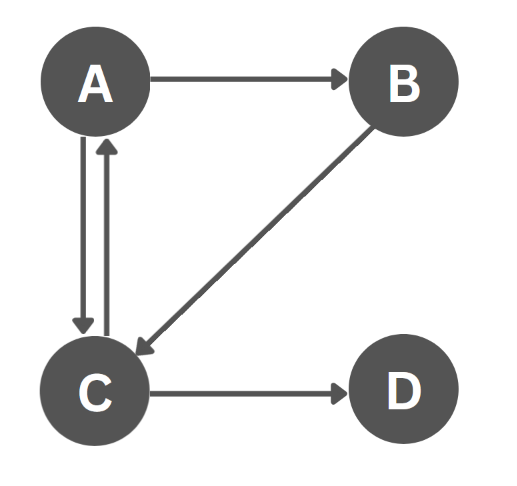
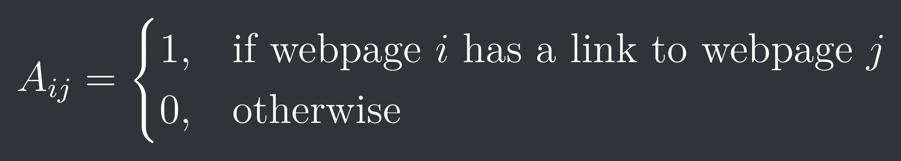
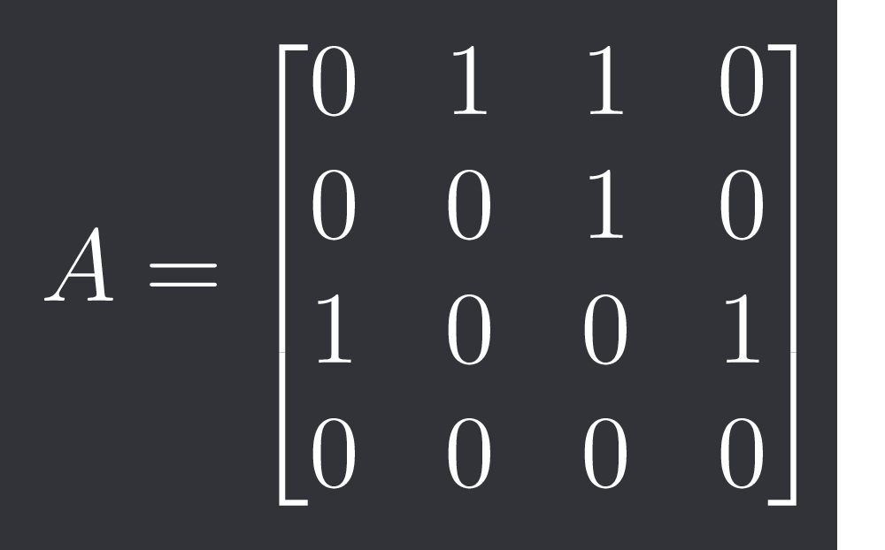
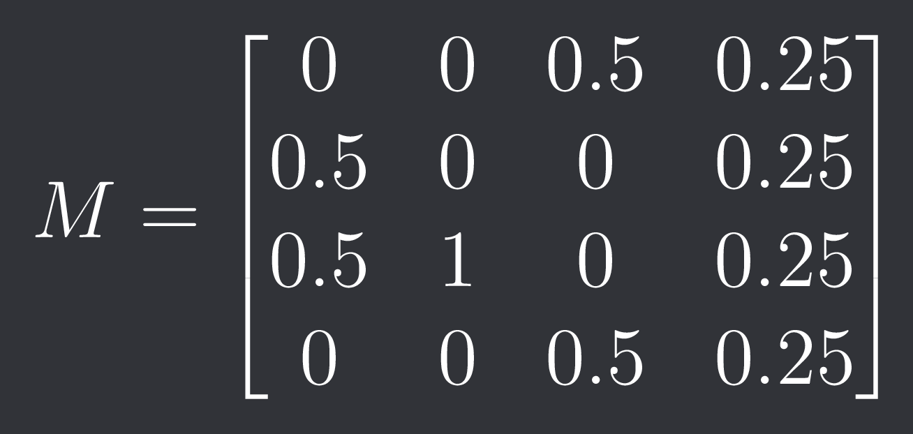

# Matrix Eigenvalues and Google's PageRank Algorithm
This project implements the **PageRank algorithm** using concepts from **matrix algebra, eigenvalues, and eigenvectors**.
The main objective is to represent webpages as a directed graph, convert the graph into matrices, and use matrix algebra to calculate the importance of each webpage.

## Let's take an example

We represent the above connection of graph as a matrix \(A\), which is defined as:

For the above graph, the matrix is:

Here, each row represents the source webpage and each column represents the destination webpage.

## Counting Outgoing Connections
Before constructing the transition matrix, we need to find the total number of outgoing connections from each webpage.
This can be calculated by adding the elements of each row of the a matrix \(A\).

This tells us that A and C have 2 outgoing connections, B has 1 and D has 0 outgoing connection.

## Transition Matrix
The number of outgoing connections tells us how the probability is distributed when a user follows links from a webpage. This is represented by 
a Transition Matrix \(M\), which is defined as: 

where:

- $L_i$ = number of outgoing links from webpage $i$
- $n$ = total number of webpages

The transition matrix for our example graph is:

Here, each column represents the source webpage and each row represents the destination webpage.
